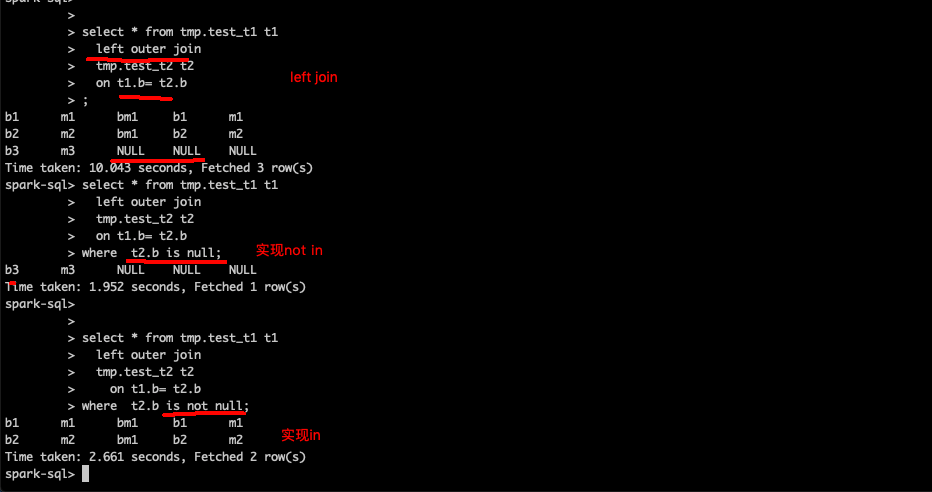

[TOC]:#
# Table of Contents
- [优化思路](#优化思路)
- [[优化实例](https://x10232.iteye.com/blog/2333304)](#优化实例)
- [[https://x10232.iteye.com/blog/2333315](https://x10232.iteye.com/blog/2333315)](#httpsx10232iteyecomblog2333315)

#### 优化思路
1. 可以使用分区表，这样有多个目录：一个分区值(value)一个目录，提高并行度。适用值域不大的情况。
2. 使用桶，通过hash（value)把不同的值，分文件处理。提供处理的并行度（hadoop的原理）。
1. 根据job_Id 查询执行的sql语句
    hive.query.string
2. 根据hive -e 输出的mapper数和 reduce数查看是否合理
3. explain查看执行计划的row numbers
4. 查看所有hive配置  hive -e "SET -v" > 1.txt

#### [优化实例](https://x10232.iteye.com/blog/2333304)
1. 非等值 join 问题
2. 优化：reduce side join VS Cartesian product
3. 改写非等值 join：union all
4. 优化：map side join
5. 优化无极限：开启 parallel 和 控制 reduce 个数
6.  在JION接连查询中没有ON连接key，而通过WHERE条件语句会产生笛卡尔集。
7. 关于Strict Mode
8. 通过left join， 实现in  和 not in
    

#### [https://x10232.iteye.com/blog/2333315](https://x10232.iteye.com/blog/2333315)

A表（id,v） B表(id,v)
在reduce阶段
    key=id
    v[]= list<A表的v,  B表的V>
如果 id=3的记录  A有2条，B有3条,则：
    key=3
    v[]= list<a.v1,a.v2,     b.v1,b.v2,v.3  >
join输出时候
  读v[0],v[1]都是A表  v[2]是B表，
        则输出 id, v[0] v[2]
        则输出 id, v[1] v[2]
     后面v[3],v[4] 同样输出
        则输出 id, v[0] v[3]
        则输出 id, v[1] v[3]

**最终得出的结论是：写在关联左侧的表每有** **1** **条重复的关联键时底层就会多** **1** **次运算处理。**
