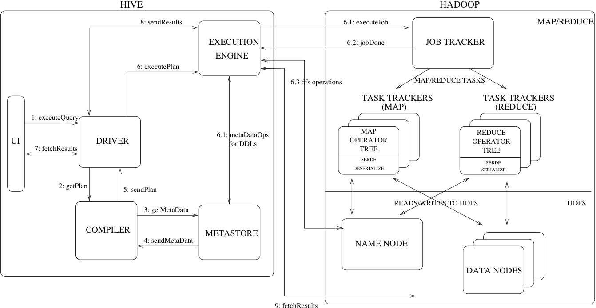

[TOC]:#
# Table of Contents
- [[安装启动](https://cwiki.apache.org/confluence/display/Hive/GettingStarted)](#安装启动)
- [使用](#使用)
    - [两种链接方式](#两种链接方式)
    - [查看表信息](#查看表信息)
    - [[正则表达式](https://blog.csdn.net/hqr20627/article/details/78038649)](#正则表达式)
    - [坑](#坑)
- [原理](#原理)
    - [过程](#过程)
- [与mysql之间的区别](#与mysql之间的区别)
- [总结](#总结)


# [HIVE](https://cwiki.apache.org/confluence/display/HIVE)




### [安装启动](https://cwiki.apache.org/confluence/display/Hive/GettingStarted)

1. [报错Found class jline.Terminal, but interface was expected](https://my.oschina.net/xiangtao/blog/611755)
2. [通俗易懂的理解](https://www.tutorialspoint.com/hive/hive_introduction.htm)

```shell
 进入/Users/ericens/tools/apache-hive-3.0.0-bin目录，该目录下有metastore路径，deby使用
  hadoop fs -mkdir       /tmp
  hadoop fs -mkdir -p     /user/hive/warehouse
  hadoop fs -chmod 777   /tmp
  hadoop fs -chmod 777   /tmp/hive/


#直接 hive 进入

#或者启动服务beeline
$HIVE_HOME/bin/hiveserver2

#启动client，没有-n的话，不能访问目录/tmp
HIVE_HOME/bin/beeline -u  jdbc:hive2://localhost:10000 -n ericens

!tables
!sql create table test1(id int,name string);

```


### 使用


#### 两种链接方式
[beeline](https://cwiki.apache.org/confluence/display/Hive/HiveServer2+Clients#HiveServer2Clients-Beeline%E2%80%93CommandLineShell)

|    | hive-cli |  beeline|
| --- | --- | --- |
| 协议 |thrift  | jdbc |
| 链接方式      | connects directly to HDFS,Hive Metastore| connects to HiveServer2 |
| | 连接数多 | 由server2链接hdfs,统一管理链接 |
| 进入内嵌模式 | hive  | beeline -u jdbc:hive2:// |
| nj 直接使用 | hive  | beeline |
| ali | hive  | beeline ; !connect jdbc:hive2://alicloud-hb3-hadoop-core01-19269.jpushoa.com:10000 -u datasrv '' |
| bjff| hive  | beeline -u jdbc:hive2:// |


#### 查看表信息

1. [根据hdfs目录文件，更新hive metaStore信息](https://blog.csdn.net/liuxiangke0210/article/details/78980087)
    1. MSCK REPAIR TABLE table_name;

2. [hive lock 锁](https://my.oschina.net/leejun2005/blog/917550)
    1. SHOW LOCKS <TABLE_NAME>;
    2. SHOW LOCKS <TABLE_NAME> EXTENDED;
    3. SHOW LOCKS <TABLE_NAME> PARTITION (<PARTITION_DESC>);
    4. SHOW LOCKS <TABLE_NAME> PARTITION (<PARTITION_DESC>) EXTENDED;

3. 结构及元数据
show create table xx;
desc xxx;
desc xxx.xx partition(data_date=2018092114);
desc formatted xxx;

一个表的元数据，不仅仅在表里有，在分区里面也有。所以如果更改表结构后，以前的历史分区的元数据 并没有改变。需要drop partition
#### [正则表达式](https://blog.csdn.net/hqr20627/article/details/78038649)


#### 坑
1. count vs sum
```
count(*) as  c0
count( case  when p.imei is null then 0    else  1 end ) as  c1
count( case  when p.imei is null then null else  1 end ) as  c2
sum  ( case  when p.imei is null then 0    else  1 end ) as  c3
sum  ( case  when p.imei is null then null else  1 end ) as  c4
```
c0=c1。
c2=c3=c4 才是正确的。

count(col) NULL values will not be counted
COUNT(* ) returns the number of records

### 原理


计划可以通过Hive的Explain命令输出，可以看：[LanguageManual Explain](https://link.zhihu.com/?target=https%3A//cwiki.apache.org/confluence/display/Hive/LanguageManual%2BExplain%23LanguageManualExplain-User-levelExplainOutput) 中的例子

##### 过程

1. 把hdfs上的文件，通过指定行line分隔符，列row分隔符，形成表的数据。同时把表的元数据metaData存储在数据库中。这样方便处理结构这些结构化的数据(行列，分隔符都制定了)。
2. hive接受 Hive QL。 通过语句解析生成MapReducer任务，执行返回给用户


- ANTLRsql字符串转化成 语法树结构
    在一个固定结构的树上抽取信息，比如SELECT根节点以下你必然能找到SELECT_EXPR子节点。
- 元数据绑定
    从Hive元数据库中查询到相关的元信息
    语义正确的SQL查询信息结构
- 产生逻辑执行计划
    单机上跑是能跑出结果的一个计算计划
- 物理执行计划
    是真正映射底层计算引擎的计算策略    ，现在Hive支持Spark，Tez和MapReduc


1. session.SessionState  ，创建本tmp地目录，hdfs创建tmp目录
2. 确定计算引擎： No Tez session required at this point. hive.execution.engine=mr.
3. 获取元数据， SemanticAnalyzer.java:getMetaData(1474)) - Get metadata for source tables
4. 确定元数据，chema(fieldSchemas:[FieldSchema(name:word, type:string, comment:null), FieldSchema(name:c1, type:string, comment:null), FieldSchema(name:c2, type:int, comment:null)], properties:null)
5. 确定任务数据： set mapreduce.job.reduces=120
6. 提交任务并验证权限，starting Job = job_1510835833211_5892561,


#### 与mysql之间的区别

1. 面向大数据
2. 仅仅解析sql句，生产执行计划，计算引擎等（MR, spark,tenz），一般都要hdsf
3. 支持嵌套类型，如果Map, List,Array等。mysql目前支持json
4. msyql行式存储，而hive既支持行式，也支持列式存储。这个根据存储结构有关

   - 查询引擎: Hive, Impala, Pig, Presto, Drill, Tajo, HAWQ, IBM Big SQL
   - 计算框架: MapReduce, Spark, Cascading, Crunch, Scalding, Kite
   - 数据模型: Avro, Thrift, Protocol Buffers, POJOs


1. hive delete 不行，因为他不是RMDS
2. 创建外部表，仅仅是引用一下外部目录而已，insert 新数据后，目录下会有新的数据文件，
3. 导出新的文件后，等于deletel了 原有的数据


### 总结
- 意义：[讲了hive的作用，起源，意义、场景。](https://www.zhihu.com/question/49969423?sort=created)
Hive就是把写的SQL语句，翻译成Mapreduce代码，然后在Hadoop上执行。
新版本的Hive也支持使用Tez或Spark作为执行引擎。
- 使用es的jar包，数据写入 elastic search
- 自己写udf把数据写入 redis
- hive 遇到有些文件里面的字段，作为分隔符时候作为了hive的分隔符，那么查询的结果是错误的。
    1. 写入时候 替换分隔符
    2. 使用parquet等格式
